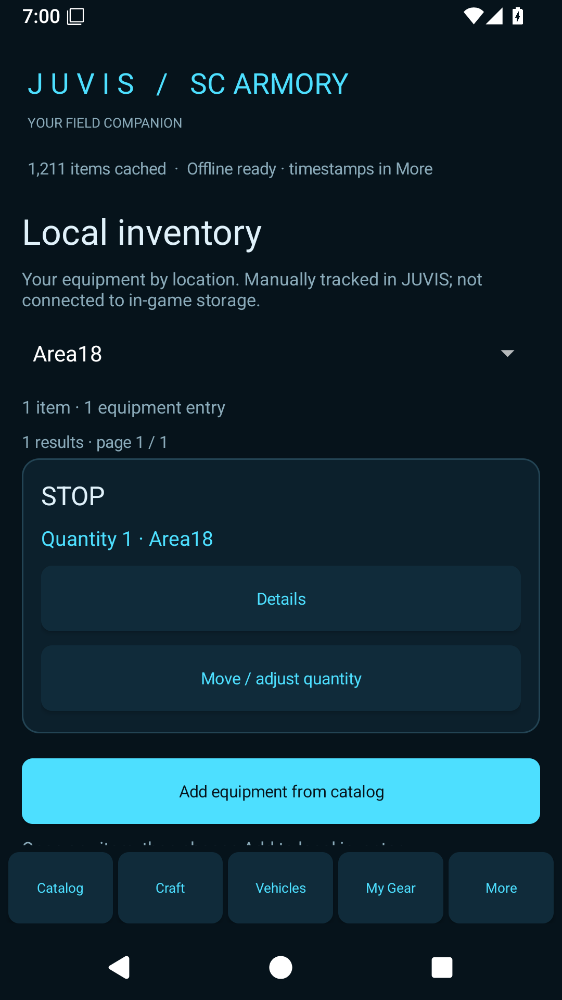
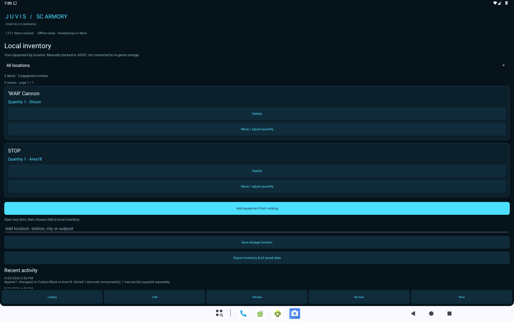
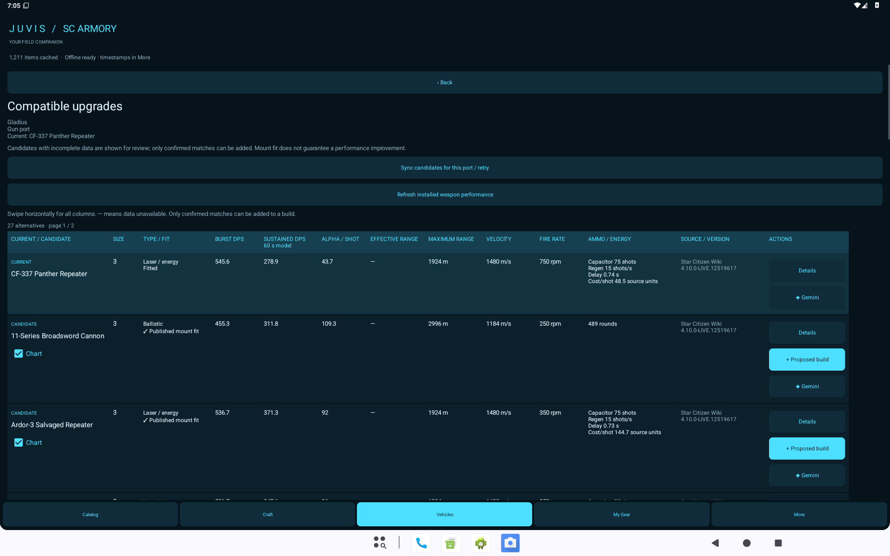
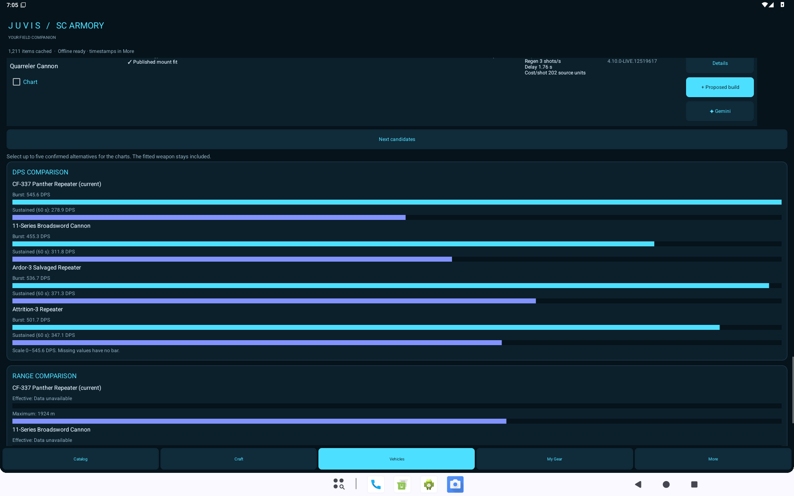

# JUVIS Android 0.1.8 — update and use

## Install over 0.1.7

1. In your current app, open **More → Export backup** and save the backup somewhere safe.
2. Download **JUVIS-SC-ARMORY-Android-v0.1.8-lightweight-update.apk** (44,763,488 bytes, about 43 MiB) to your Android phone or tablet. This is the easier update download. The full-images APK is about 780 MiB and is optional if you need every bundled picture offline.
3. Open it in Files and choose **Update**. Allow installation from Files if Android asks.
4. Open JUVIS and check your saved gear. **Do not uninstall first.** This APK keeps the existing app ID and signing certificate.
5. Use **More → Sync all sources** to refresh an existing catalog, or refresh a particular vehicle/item. Installing an update preserves your cached data rather than replacing it with the bundled snapshot.

The AAB is for distribution tooling; it cannot be installed by tapping it. Android 8 or later is required. Both APKs include ARM64 and x64. The lightweight update preserves your saved data and catalog, but does not include the 3,730 bundled offline images. Images available online can load and cache when viewed. The full-images APK contains that offline pack. If your installed app came from another builder and Android reports a signing conflict, keep it installed and retain your exported backup before changing anything.

If Android says **“There was a problem parsing the package,”** check that the file ends in `.apk` and that the download finished. The lightweight APK must be **44,763,488 bytes**. A smaller file is incomplete; download it again. Do not uninstall your existing app to troubleshoot a parsing error.

## Local inventory by location

Open **More → Local inventory by location**, or the same button in **My Gear**. Add a city, station or outpost, such as Area18, Orison or a home station. These are your own named storage locations.

Open an equipment item from Catalog and tap **Add to local inventory**. Select a location, enter the quantity and tap **Add equipment here**. In inventory, use the location selector to filter items, or **All locations** to see everything. **Move / adjust quantity** transfers equipment between locations or removes a chosen quantity from tracking.

Owned, Need and Favorite remain independent tags. Adding a quantity does not silently change those tags. Inventory is manual tracking inside JUVIS; the app does not read or change your in-game inventory.

## Upgrade a ship and store the old equipment

1. Open **Vehicles**, choose a ship or ground vehicle, and refresh its stock loadout if needed.
2. Expand a category, open **Show compatible upgrades**, and add a confirmed matching candidate to **Proposed build**.
3. Review the proposed changes, then tap **Apply build & store removed equipment**.
4. Choose the location where you are fitting the new equipment. JUVIS consumes available replacement parts from that location and deposits removed equipment there.
5. If the new parts are not recorded in that inventory, add them first or explicitly check **I supplied the missing new parts separately**.
6. Confirm the change. JUVIS remembers the fitted equipment, clears the applied proposal and records the transaction. Merely saving a proposal never moves inventory.

If you replace a mount containing other equipment, those removed components are stored too. The replacement mount's child slots remain unavailable until their layout can be verified; JUVIS does not assume they have the old mount's layout.

## Loadout categories and comparisons

Loadouts use six groups: **Weapons, Avionics, Liveries, Propulsion, Utility and Misc.** Empty groups are omitted. Quantum drives are under Avionics. Normal view shows published player-upgradeable ports; **Advanced View** includes fixed/internal and unknown ports for inspection.

Comparison tables use columns. Swipe horizontally for size, fit, damage type, DPS, alpha, range, projectile velocity, fire rate, ammunition/energy, source/version and actions. Only confirmed mount matches can be added to a build. A fit does not guarantee better performance on your ship.

Ship weapons have a **Weapon Performance** detail section and DPS/range charts. Select up to five confirmed alternatives for a chart; the fitted weapon remains included. A dash means the source has no verified value. Sustained DPS uses the source's 60-second reference model, and maximum projectile range is separate from effective range.

## Back up your progress

Export/Import now includes storage locations, quantities, fitted loadouts and inventory history as well as the existing gear flags, craft plan, proposed builds and settings. Older backups still import. Import merges matching inventory entries by replacing their quantities, not adding them, so importing the same backup twice does not double your equipment. Importing an older backup may restore its older quantities; review before confirming.

## Source and builds

The complete source ZIP contains the existing native C# app, its .NET core library, tests, documentation and all offline images. See the root README and Build-Android.ps1. Both APK and AAB are development-signed builds. The private signing key is intentionally excluded from the source ZIP.
